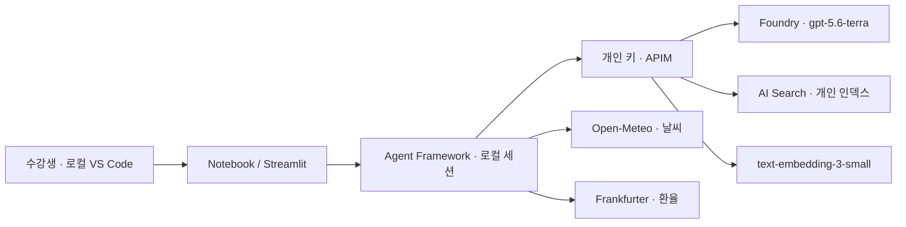

# Azure Agent + RAG 핸즈온 워크숍 🇰🇷

**가상 한빛테크 출장 도우미**를 만들며 Microsoft Foundry의 `gpt-5.6-terra`, **Microsoft Agent Framework**, **Azure AI Search**를 배웁니다. 기본 AI 교육 다음 단계의 한국어 실습입니다.

> 사내 규정은 RAG, 현재 날씨·환율은 외부 API 도구 호출. 단일 에이전트가 필요한 도구를 선택하고 근거와 함께 답합니다. 실제 회사 자료나 예약·결제를 다루지 않습니다.



## 바로 시작 — 수강생

**Python 3.11, uv, VS Code의 Python/Jupyter 확장**을 준비하세요. 학생에게 Azure 계정은 필요 없습니다. 강사에게 본인용 `.env`를 받습니다.

```bash
git clone https://github.com/YOONPYOGitHub/azure-agent-rag-workshop.git
cd azure-agent-rag-workshop
uv sync --frozen
code .
```

1. 개인 `.env`를 저장소 루트에 저장합니다. 없다면 `.env.example`을 복사해 강사가 준 값을 채웁니다.
2. VS Code에서 `notebooks/00_setup.ipynb`를 열고 **.venv 커널**을 선택합니다.
3. 아래 순서대로 실행합니다. 03에서 본인 인덱스를 생성·업로드합니다.
4. 챗봇: `uv run streamlit run app/streamlit_app.py`

| 순서 | 노트북 | 핵심 |
|---|---|---|
| 00 | [환경 준비](notebooks/00_setup.ipynb) | 구성 요소, 첫 모델 호출 |
| 01 | [수동 함수 호출](notebooks/01_llm_and_tools.ipynb) | 스키마 → 요청 → 실행 → 결과 전달 |
| 02 | [Agent Framework](notebooks/02_agent_framework.ipynb) | 지침·도구·세션·자동 실행 루프 |
| 03 | [문서 인덱싱](notebooks/03_indexing.ipynb) | 청킹·임베딩·개인 Search 인덱스 |
| 04 | [RAG와 인용](notebooks/04_rag_and_citations.ipynb) | BM25/벡터/하이브리드 비교 |
| 05 | [대화형 에이전트](notebooks/05_conversational_agent.ipynb) | 세 도구 통합, 실제 챗봇 |
| 06 | [평가·안전성](notebooks/06_evaluation_safety.ipynb) | 근거 없음, 키 비노출, 회귀 점검 |

각 노트북에 개념·실행 코드·관찰·연습·예시 해설이 있습니다. **공개 원본에는 실제 실행 출력/키가 없습니다.**

## 폴더 구조

```text
notebooks/              # 개념을 따라가는 7개 실습
src/hanbit_assistant/    # 재사용 가능한 설정·API 도구·RAG·Agent 코드
app/streamlit_app.py     # 실제 대화 UI
data/policies/         # MIT · 새로 작성한 가상 정책 9개
infra/                  # 강사 전용 Azure 생성·검증·삭제 및 정책
scripts/                # 노트북 검사/실행, 실제 권한/동시 요청 검사
docs/                   # 수강생·강사·보안·출처 가이드
.local/                 # 비공개 키/배포 상태/실행 결과 (Git 제외)
```

## 강사와 10명 리소스 구성

[강사 가이드](docs/instructor.md) · [수강생 가이드](docs/student.md) · [커리큘럼](docs/curriculum.md) · [보안 경계](docs/security.md) · [출처와 이전 repo 비교](docs/references.md)

- 기존 Foundry 모델과 기존 APIM을 사용하되 **기존 API는 수정하지 않습니다**.
- 전용 리소스 그룹에 **Search Basic 1 replica / 1 partition**을 생성합니다.
- 수강생 `student01`~`student10` + 강사 `instructor`: **키 11개, 인덱스 11개**.
- APIM이 키별 인덱스와 허용된 API 경로를 서버에서 제한합니다. Search 관리자 키를 배포하지 않습니다.
- 에이전트는 학생 컴퓨터에서 실행합니다. Foundry Agent Service 호스팅·별도 Foundry 프로젝트는 필요하지 않습니다.
- 검색용 임베딩 배포는 `text-embedding-3-small`, 1536차원입니다. 기본 RAG는 BM25+벡터이며 Semantic Ranker는 선택 사항입니다.

[실제 실행 검증 기록과 화면](docs/verification.md)

## 재현과 검증

```bash
uv sync --frozen
uv run pytest tests infra/tests -q
uv run python scripts/run_notebooks.py --check
# 실제 Azure/API 사용, 03은 인덱스 쓰기: 개인 .env 필요
uv run python scripts/run_notebooks.py --execute
```

라이브 실행 결과는 `.local/notebook-runs/`에만 저장합니다. 오프라인 테스트의 외부 API fixture는 실제 서비스 검증이 아닙니다. 실제 배포 상태와 실행 증거는 강사에게 별도로 확인하세요.

## 비용·사용 범위

한국 중부 Search Basic 정가 확인값은 **US$0.101/시간**(1 Search Unit), 24시간은 **US$2.424**, 730시간 가정은 **US$73.73**입니다. 모델·임베딩·APIM·세금은 별도이며 계약 가격은 다를 수 있습니다. **Search는 사용하지 않아도 삭제 전까지 과금**됩니다.

Open-Meteo 무료 API는 비상업 교육 콘텐츠 범위에서 사용하며 CC BY 4.0 출처를 표시합니다. 상업 제품으로 전환할 때는 서비스 약관을 다시 검토하세요. 환율은 은행 환전/회사 정산의 확정 견적이 아닙니다.

MIT License. 가상 문서는 실제 규정이나 법률·세무 자문이 아닙니다.
