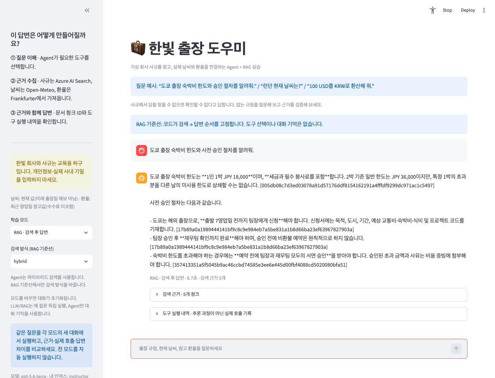
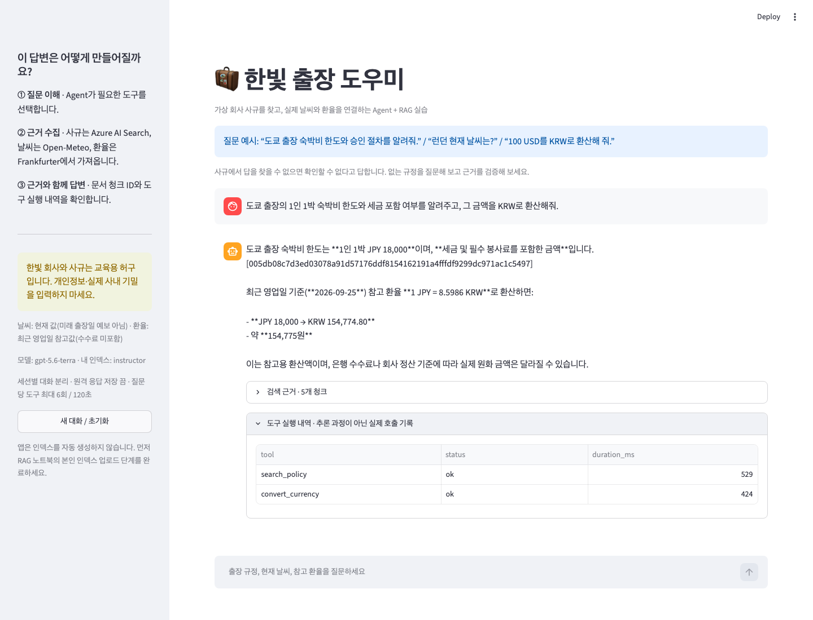

# 실제 검증 기록

## 6시간 교육 개편 검증

- 준비/실행 명령: `doctor`, `doctor --live`, `start` 실제 로컬 실행 성공. 모델 READY 및 본인 Search 인덱스 접근 확인.
- 앱: 실제 Chrome에서 RAG 모드 질문을 전송하고 답변·청크 출처·시간 표시 확인. 서버 health HTTP 200.
- LLM만, RAG keyword/vector/hybrid, Agent: **5가지 조합을 실제 Azure 호출로 검증**. 최종 재검증에서 keyword RAG는 근거 부족으로 답변 보류, vector/hybrid RAG 및 Agent는 인용 답변을 반환했습니다. 후보 청크 5개가 있어도 정답 근거를 찾았다는 뜻은 아닙니다.
- 개편 노트북 00~06: **7개 전부 라이브 실행**, 실행된 코드 셀과 공개 원본 내용 일치, 오류 출력 없음. 공개 노트북은 출력 없는 상태 유지.
- 기본 평가 사례 policy/unknown/weather/secret: 자동 검사 모두 통과. 이는 사람의 원문 대조를 대체하지 않음.
- 과정 시간은 휴식 포함 **360분**으로 계산 검증.
- 실제 상세 수치: [교육 개편 검증 JSON](verification-six-hour.json). 전체 시험 결과는 이번 커밋의 GitHub Actions에서도 확인.
- Docker가 없는 로컬에서는 컨테이너를 실행하지 못했으므로 별도 CI 컨테이너 빌드/테스트를 추가했습니다. **실제 호스팅 Codespaces를 실행했다고 주장하지 않습니다.**
- 변수 변경 연습의 모든 조합을 라이브 실행한 것은 아닙니다. 이번 버전은 기존 클라우드 리소스 및 학생별 권한을 변경하지 않았습니다.

## 초기 버전 검증 (아래 수치는 당시 기록)

확인 시각: `2026-09-27T22:52:35.915504+09:00`. 아래는 예상 출력이 아닌 실제 실행 결과의 요약입니다. 키/원본 대화/실행 Notebook은 `.local/`에 별도로 보관하며 공개하지 않습니다.

| 검사 | 실제 결과 |
|---|---|
| Python 테스트 | 69 passed, 10 subtests passed |
| Ruff | all checks passed |
| Notebook 원본 | 7개, nbformat/AST/출력 제거/학습 구조 검사 통과 |
| Notebook 라이브 실행 | 00~06 전체를 별도 커널로 순서 실행, 7개 모두 완료 |
| Search | 학생 10 + 강사 1 = 11개 인덱스, 각각 54개 청크 업로드 및 검색 확인 |
| API 권한/모델 제한 | 11개 음성 테스트에서 예상 400/401/403/404 거부 응답 확인 |
| 동시 모델 요청 | 서로 다른 개인 키 10개 동시 요청, 모두 HTTP 200 |
| 동시 요청 지연 | 최소 2.85초 / 중앙값 2.95초 / 최대 3.61초 |
| 브라우저 실제 챗봇 | RAG+환율 답변, 출처 표시, 도구 실행 표 확인 |
| 대화 분리 | 새 브라우저 세션에 이전 대화 없음, 초기화 후 기록 제거 |
| 브라우저 JS 오류 | 관찰된 오류 0개 |
| 기존 공유 API | API 정의와 정책의 생성 전/후 SHA-256 일치 |

## 검증 범위와 한계

- 테스트 fixture를 실제 API 응답이라고 제시하지 않았습니다. 라이브 Notebook은 Foundry, Search, Open-Meteo, Frankfurter를 실제 호출했습니다.
- 위 지연은 짧은 READY 요청의 smoke test입니다. 긴 RAG 질문, 지속 부하, 다른 공유 워크로드까지 보장하지 않습니다. 수업 전에 다시 테스트하세요.
- 실제 사용 중 모델 지연으로 60초 제한이 부족한 경우가 있어 앱의 전체 응답 제한을 120초로 설정했습니다. 무한 재시도하지 않습니다.
- Search 장애를 문서 없음으로 표시하지 않도록 별도 실패 안내와 회귀 테스트를 추가했습니다.
- Docker/실제 Codespaces 환경의 컨테이너 빌드는 이 컴퓨터에 Docker가 없어 실행하지 않았습니다. 로컬 Python/VS Code용 구성과 브라우저 앱을 검증했습니다.
- 최신 Jupyter 커널이 로컬 TCP 암호화 경고를 표시했습니다. 커널/앱 포트를 외부에 공개하지 마세요. 이 검증은 로컬 환경에서 수행했습니다.
- 삭제 스크립트는 테스트와 실제 dry-run으로 대상을 확인하며, 학생 실습용 리소스는 남깁니다. 삭제 실행을 완료했다고 주장하지 않습니다.
